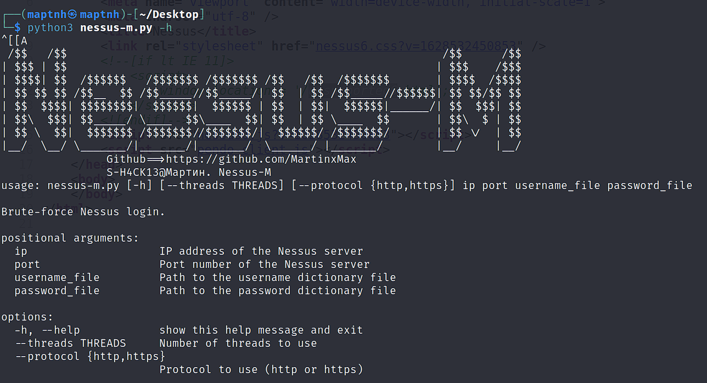
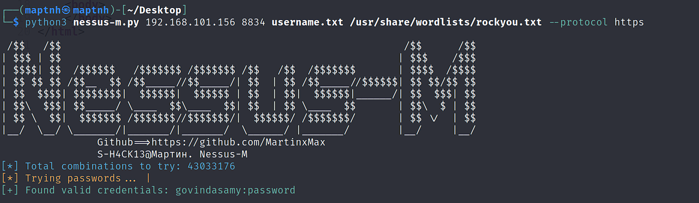
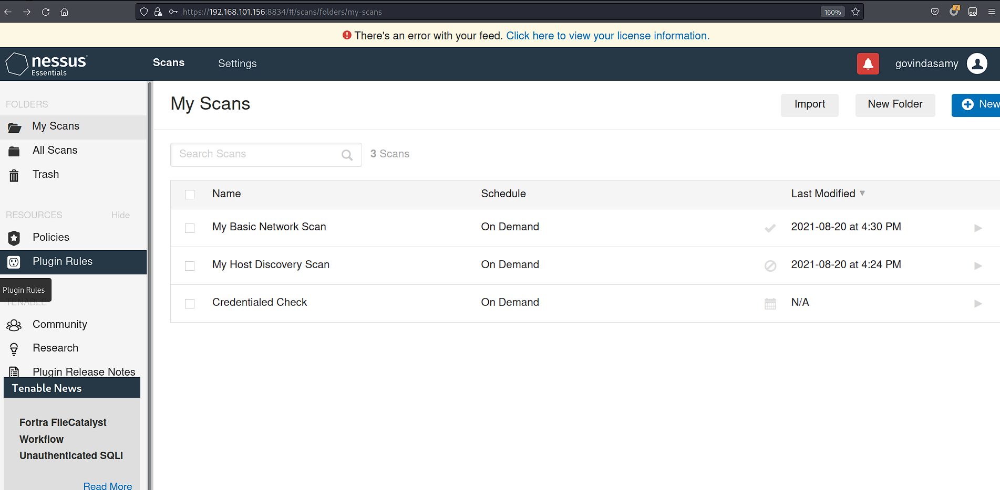

# Nessus-M

A brute-force tool for Nessus vulnerability scanner login interface

# Help Information

`$ python3 nessus-m.py -h`

# Brute-Force

`$ python3 nessus-m.py 192.168.101.156 8834 username.txt /usr/share/wordlists/rockyou.txt --protocol https`

